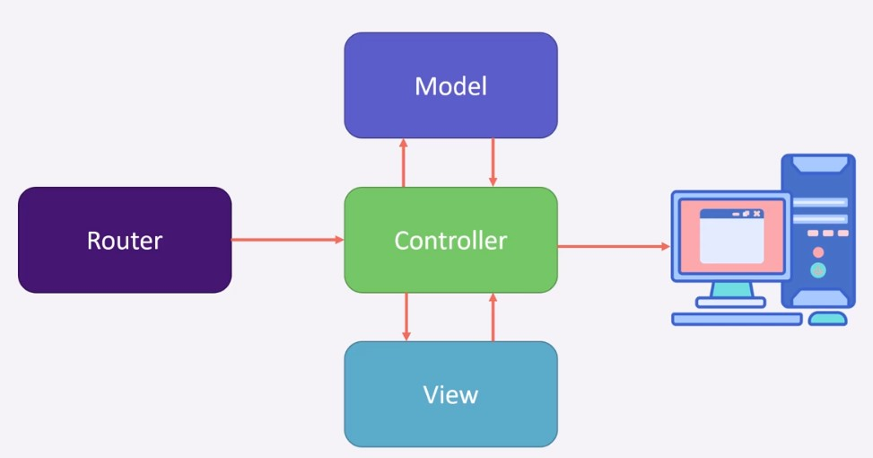
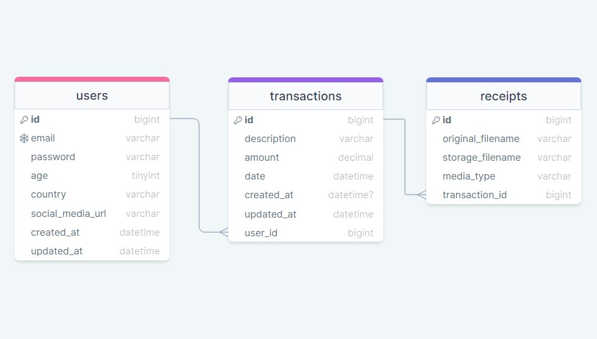
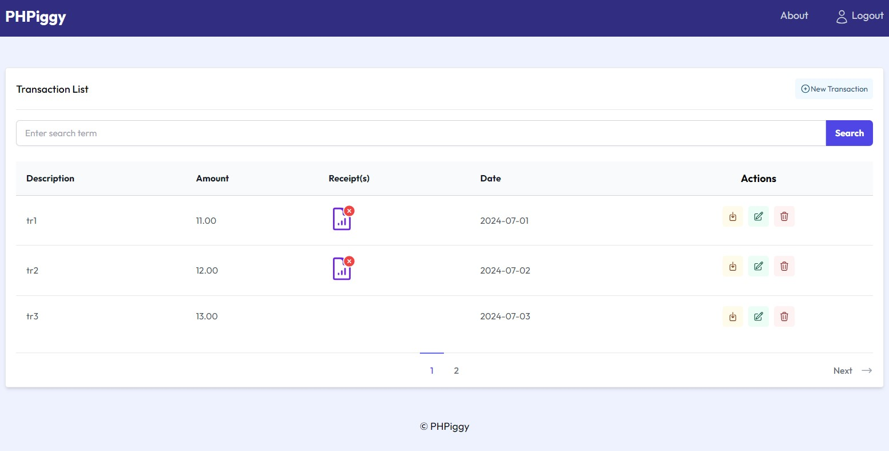
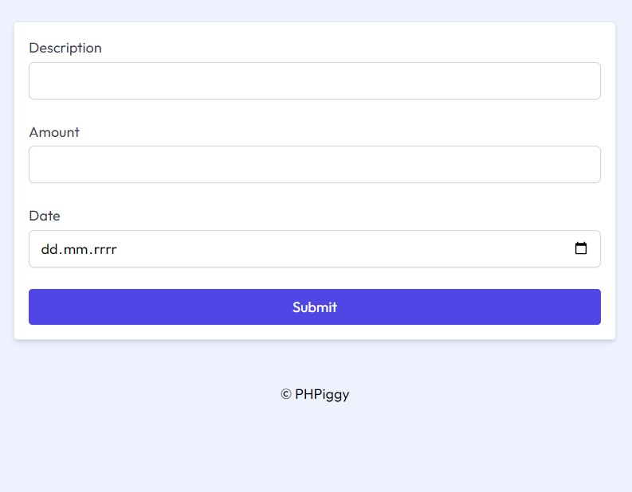

# PHPiggy

Complete Modern PHP Developer Course. Includes SQL and MVC Framework.

## Table of contents

- [Overview](#overview)
  - [About the course](#about-the-course)
  - [Master Project](#master-project)
  - [Useful resources](#useful-resources)

## Overview

### About the course

This course consists of practical and fun code examples, important theory about how PHP works behind the scenes and complete project.

Main content:

- PHP fundamentals,
- OOP,
- design patterns: MVC, singleton pattern, factory pattern, dependency injection,
- modern tools: Composer, Packagist,
- understanding PSR,
- SQL queries,
- code challenges,
- master project

### Master Project

Expense tracking application consist of two components - application and custom framework.
Application compoment has a specific code which is tightly coupled to project and it wouldn't work separately without making major adjustments.
Framework component has a specific code but this code is portable and flexible.

This project also uses MVC design pattern which is responsible for splitting code (dividing responsibilities) into separate files (separation of concerns principle).

The MVC pattern is an acronym for Model-View-Controller:

- Model refers to the database logic,
- View refers to the HTML or template of a page,
- Controller refers to the logic for the page.

The following functionalities have been implemented in the application:

- routing,
- form validation,
- user registration and authentication,
- CRUD transations,
- handling file uploads (receipts).

Project screenshots:

- Application logic - it shows how the MVC pattern works:

  

- Database:

  

- Home page (transaction list):

  

- Adding new transaction:

  

### Useful resources

- https://www.udemy.com/course/complete-modern-php-developer/
- https://www.php.net/manual/en/
- https://getcomposer.org/
- https://regex101.com/
- https://json-ld.org/
- https://mariadb.com/
- https://www.php-fig.org/psr/
